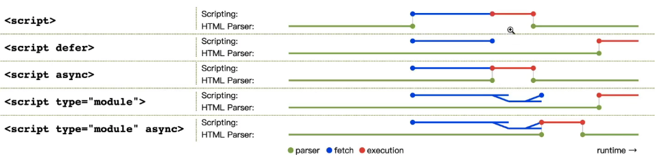

### 什么是JavaScript

JavaScript是由ECMAScript、DOM（文档对象模型）、BOM（浏览器对象模型）组成；

#### 1、ECMAScript

- 语法
- 类型
- 语句
- 关键字
- 保留字
- 操作符
- 全局对象

ECMAScript浏览器支持情况：

- 在线检测浏览器支持[https://ruanyf.github.io/es-checker/index.cn.html]
- 在线查询浏览器支持&兼容性查询（CSS、Html5、SVG、JS-Api）http://caniuse.com/ciu/index

#### 2、DOM

#### 3、BOM

常见BOM对象

- 弹出新浏览器窗口能力；
- 移动、缩放、关闭浏览器窗口能力；
- navigator对象，提供关闭浏览器的详尽信息；
- location对象，提供浏览器加载页面详尽信息；
- screen对象，提供关于用户屏幕分辨率的详尽信息；
- performance对象，提供浏览器内存占用、导航行为和时间统计的信息；
- 对cookie的支持；
- 其他自定义对象，如XMLHttpRequest和IE的ActiveXObject;

### HTML中的JavaScript

#### 1、script标签属性

- async：立即下载脚本，但不能阻止文档渲染。异步加载，不能保证按照他们在页面中出现的次序执行，所以异步脚本不应该再加载期间修改DOM；
- defer：脚本立即下载，但延迟到（DOMContentLoaded事件之前）文档完全被解析和显示之后再执行。
- chatset：指定字符集；
- crossorigin：配置相关请求的CORS（跨域资源共享）设置。默认不使用CORS。
  - anonymous：配置文件请求不必设置凭证标志；
  - use-credentials：设置凭据标志，意味出站请求会包含凭据；
- integrity：允许对接收到的资源和指定的加密签名以验证字资源完整性。可以用于确保内容分发网络（CDN）不会提供恶意的内容；
- src：包含要执行的代码的外部文件；
- type：代替language，

### 3、语言基础

#### 3.1、语法

- 区分大小写；
- 标示符（即变量、函数、属性、函数参数名称），命名规则如下：
  - 第一个字符必须是字母、下划线、美元符号；
  - 剩下字符可以是字母、下划线、美元符号、数字；
  - 按照ECMAScript标示符使用驼峰大小写
- 单行注释、块注释；
- 严格模式（"use strict"）;
- 语句，ECMAScript中语句以分号结尾，代码块由花括号闭合（例如：if(true){}）；

#### 3.2、关键字和保留字

#### 3.3、变量

变量声明var、let、const

#### 3.4、数据类型

- String
- Number
- Boolean
- symbol
- undefined
- object
- function
- null

### 4、变量、作用域、内存

#### 4.1 原始值、引用值

- 引用值和简单值赋值问题

确定类型

- typeof 适合判断原始类型（字符串、数值、布尔值、undefined）
- instanceof 操作符
- Object.protype.tostring.call(this) 

#### 4.2 执行上下文与作用域

作用域链

活动对象（Active Object）

作用域链增强

- try/catch语句的catch块
- with语句

变量声明

- var声明的会被提升到函数或是全局作用域的顶部，
- 未经声明的变量就被初始化，会自动添加到全局上下文。
- let块级作用域声明，if块、while块、function块等{}块；存在暂时性死区、不能重复声明
- const块级作用域常量声明，
  - 暂时性死区
  - 不能重复声明
  - 声明时需要初始化值，不能赋值修改，
  - 但是引用类型可以对属性值进行操作，对象可以通过Object.freeze()禁止修改

标示符查找

#### 4.3 垃圾回收

