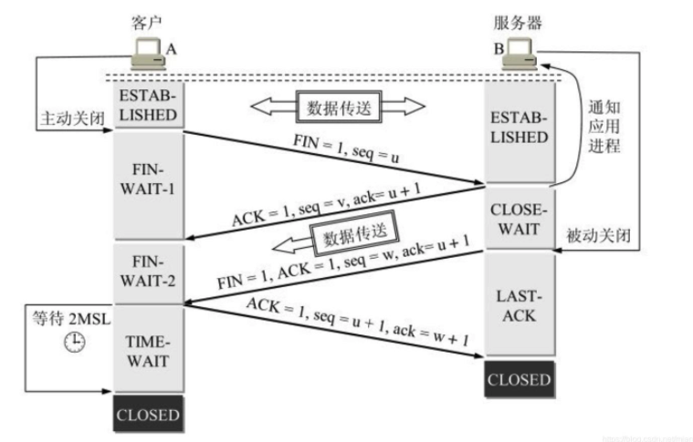

## 浏览器器输入网址后发生了什么？

1、URL解析（DNS解析）

2、建立TCP链接（三次握手、四次挥手）

3、浏览器解析、执行、渲染

## 1、URL解析

1. 浏览器缓存：浏览器一般会缓存DNS记录一段时间，不同浏览器缓存时间不同，一般2～30分钟不等；

2. 系统缓存：当浏览器未查询到缓存，会查询系统host文件；

3. 路由器缓存：路由器一般也会有自己DNS缓存，前面请求发给路由器，查找ISP（互联网服务提供商）缓存的DNS的服务

4. DNS服务器查找

   1. 递归查询：如果上述步骤扔未获取，则ISP的DNS服务器会进行递归查询，

      递归查询就是如果主机所查询的本地服务器也不知道被查询的域名的IP地址信息，那么本地域名服务器就以DNS客户的身份，向其根域名服务器继续发送查询请求报文，而不是让该主机自己进行下一步查询（本地域名服务器是通过DHPC协议获取地址，DHPC是负责分配IP地址的）

   2. 迭代查询：本地域名服务器采用迭代查询，先向一个根域名服务器查询。

      本地域名服务器向根域名服务器的查询一般都是采用迭代查询。所谓迭代查询就是当根域名服务器收到本地域名服务器发出的查询请求报文后，要么告诉本地服务器下一步查询哪一个域名服务器，然后本地域名服务器进行后续查询。（而不是替代本地域名服务器进行后续查询） 

## 2、建立连接

### 三次握手

主要问题：

- 为什么不是两次握手

  1. client发送连接请求时，网络原因，sever没有接收到，客户端会以为请求丢失会再发送一个连接请求。这是网络恢复，服务会接收到多个连接请求，造成服务端资源浪费；
  2. 当服务器端接收到请求后，未收到client确认返回，会重新发送确认确认信息，若多次未收到client确认会关闭连接；

- 为什么不是四次握手

  1、因为通讯是不能保证是100%的，客户端和服务器都不确定消息是否完完全全被接收到了，增加握手的次数，并不能显著提高可靠性了，只能无线趋近于100%。

### 四次挥手

主要问题：

- 为什么建立连接是三次握手，关闭连接确是四次挥手

​	建立连接的时候， 服务器在LISTEN状态下，收到建立连接请求的SYN报文后，把ACK和SYN放在一个报文里发送给客户端
​	关闭连接时，服务器收到对方的FIN报文时，仅仅表示对方不再发送数据了但是还能接收数据，而自己也未必全部数据都发送给对方了，所以己方可以立即关闭，也可以发送一些数据给对方后，再发送FIN报文给对方来表示同意现在关闭连接，因此，己方ACK和FIN一般都会分开发送，从而导致多了一次。

### 浏览器渲染

- 根据HTML结构生成DOM数据
- 更具CSS生成CSSOM
- 将DOM和CSSOM整合成RenderTree
- 根据RenderTree开始渲染和展示
- 遇到Script时，会执行并阻塞渲染

#### 常见相关问题

1. script标签属性

   - async：立即下载脚本，但不能阻止文档渲染。异步加载，不能保证按照他们在页面中出现的次序执行，所以异步脚本不应该再加载期间修改DOM；

   - defer：脚本立即下载，但延迟到（DOMContentLoaded事件之前）文档完全被解析和显示之后再执行。

   

2. 重绘和回流

   - 重绘：当渲染树中的一些元素需要更新属性，而这些属性只影响到元素的外观、风格，而不会影响到布局的操作，比如：background-color

     重绘没有导致DOM的几何属性的变化，因此元素的位置信息不需要更新，而省去布局的过程，

     

   - 回流：当渲染树中的一部分或全部的元素的规模尺寸、布局、隐藏等改变而需要重新构建的操作，会影响到布局的操作，

     常见引起回流的属性和方法：任何会改变几何信息的操作，都会触发回流。

     - 添加/删除可见的DOM元素
     - 元素尺寸改变--边框、填充、边距、宽高
     - 内容变化，比如用户在input框输入文字
     - 浏览器窗口尺寸的改变--resize事件
     - 计算offsetWidth和offsetHeight属性
     - 设置style样式
     - 修改网页默认字体时

   - 合成

     比如利用CSS3的transform、opacity、fitler这些属性可以实现合成的效果，

   

   渲染页面时常见哪些不良现象：

   - FOUC：主要指样式闪烁的问题，由于浏览器渲染机制（比如fixfox），在CSS加载之前，先呈现HTML，就会导致展示出无样式的内容，然后样式突然呈现的现象。主要原因是CSS加载时间过长，或是CSS被放到文档底部。
   - 白屏：有些浏览器渲染机制（比如Chrome）要先构建DOM树和CSSOM数据，构建完成后再进行渲染，如果CSS部分放在HTML尾部，由于CSS未加载完成，浏览器迟迟未渲染，从而导致白屏；也有可能是把JS文件放在头部，脚本家在会阻塞后面文档内容的解析，从而页面迟迟未渲染出来，出现白屏问题。

3. 